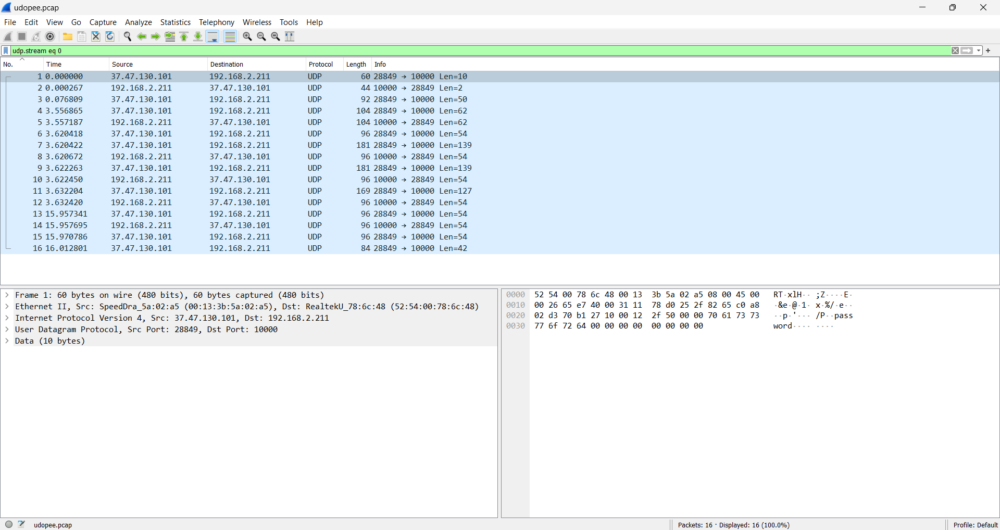
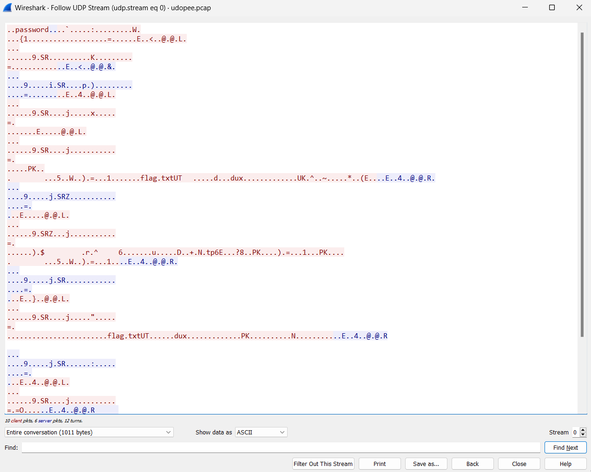
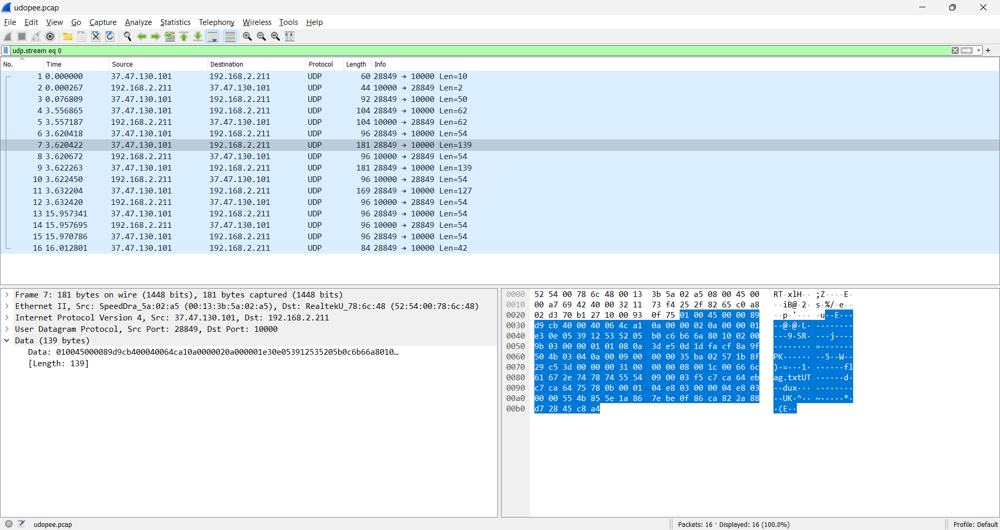
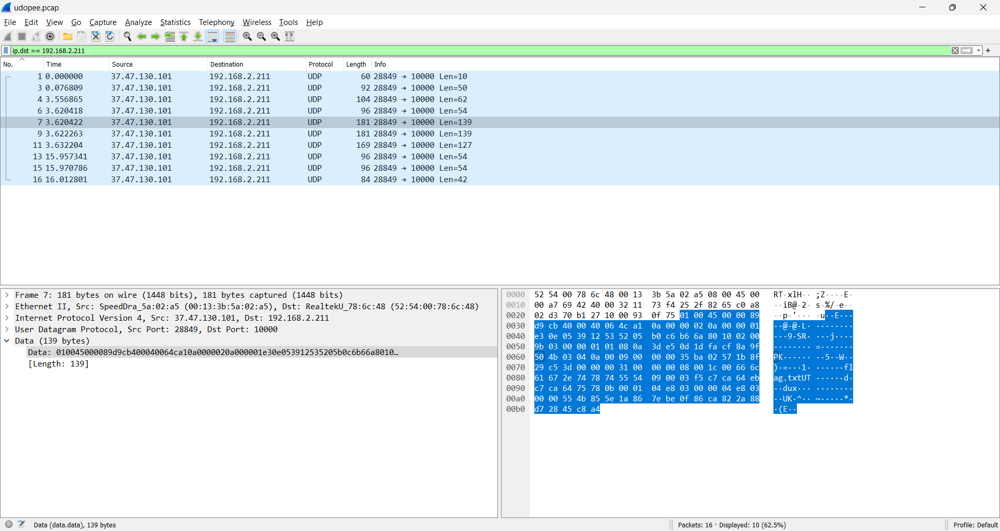
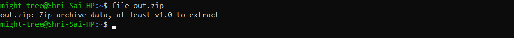

# U Do Pee?

## Challenge Description

There was weird traffic on port 10000. Apparently employee 'astroza' tried to bypass our firewall restrictions using a udptunnel tool obtained from GitHub. They said we won't be able to see the traffic, since the tool configures a 'password' to run.

What was the employee trying to download to their computer?

## Challenge Writeup

We are given a PCAP file, which on opening in Wireshark shows a capture of a few UDP packets.

   

On following the UDP stream, we view:

   

Stream 0 is the only available stream. We notice two mentions of `flag.txt` in the stream; this means the flag is being sent via this channel - pretty much expected. We then go back to the challenge description: 'astroza', udptunnel, Github. *Hmm*. We then look up *udptunnel Github* on Google, and sure enough we find a [Github repository](https://github.com/astroza/udptunnel) for this owned by the user *astroza*. In the README, we find instructions of usage including finding the public IP address and choosing a common password. Okay, so maybe there is nothing particularly useful in this repository except that this explains the *password* in the UDP stream above. We guess that *password* itself is the password that was used by our 'astroza', and we make a note of this for later when a password may be required.

We turn our attention back to the UDP stream. With nothing else given, there must be something (or everything) hidden in this stream. We observe The occurences of `PK` at a few places in the stream - *Eureka!* We know that the Magic Bytes of a ZIP file are `PK..`, and the corresponding hexdump of packet 7 confirms the signature: `50 4b 03 04`. 

   

We also know that `50 4b 05 06` marks the end of a ZIP file. Additionally, we know from the challenge description that the "weird traffic" is on port 10000. So, we first apply a filter to display all the packets whose destination port is 10000. Next, we locate `50 4b 05 06` in the 11th packet hexdump. So, we extract out the hexdump from line 0060 onwards of the 7th, 9th and 11th packets.

   

We save the resulting hexdump in [out.txt](out.txt). We rename out.txt to out.zip, and run `file out.zip` in the terminal to ensure that we indeed have retrieved the ZIP file.

   

Now, we unzip the ZIP file, enter *password* as the password when prompted, and extract `flag.txt`. The contents of this text file is a string of base64 encoded text `RU5Pe0FOMFRIM1JfVFVOTjNMX0FOMFRIRVJfQ0hBTEx9Cg==`, which is likely the flag.

On decoding this with `base64 -d flag.txt`, we obtain the flag: 
**ENO{AN0TH3R_TUNN3L_AN0THER_CHALL}**

---
**Author:** might-tree
