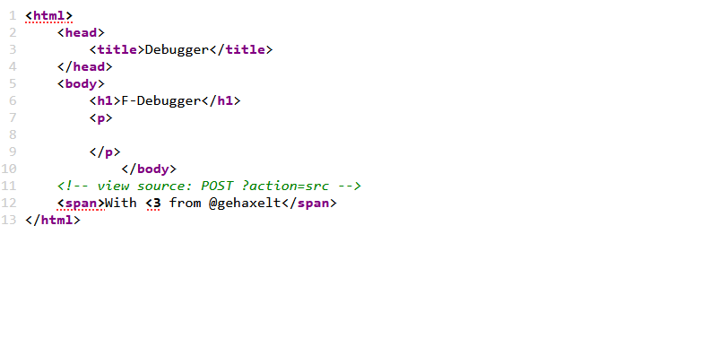

# Debugger

## Challenge Description
My friend implemented their own PHP-Info-based debugger... and said that since only 127.0.0.1 can access it, we can ship it to production! 
http://52.59.124.14:10018

## Challenge Writeup
We are provided with a link to a webpage with the following content:

   
<!--   An average linux user's desktop -->

First off, we take a look at the source code using `view-source:` , which gives us the following:

   

---
**Author:** might-tree
