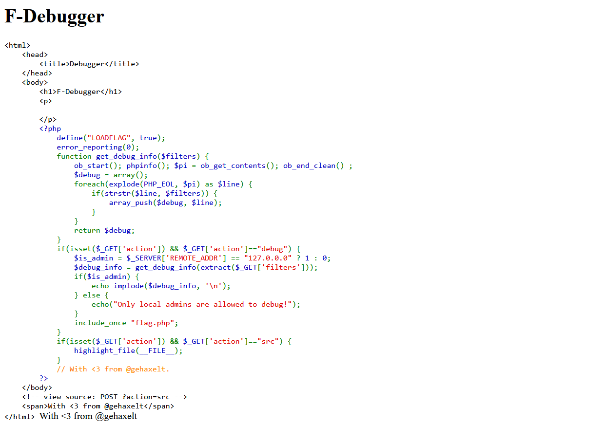

# Debugger

## Challenge Description
My friend implemented their own PHP-Info-based debugger... and said that since only 127.0.0.1 can access it, we can ship it to production!<br>
http://52.59.124.14:10018

## Challenge Writeup
We are provided with a link to a webpage with the following content:
<p align="center">
  <br>
<!--   <sup>An average linux user's desktop</sup> -->
</p>

First off, we take a look at the source code using `view-source:` , which gives us the following:
<p align="center">
  <br>
</p>

We observe that the comment in the above HTML code suggest an action for viewing the source code. So, we add `?action=src` to the given URL and hit enter. The following shows up:
<p align="center">
  <br>
</p>

Interesting! We note that in this php code there is a variable called `is_admin` that takes on binary values based on the conditional output of a ternary operator. The useful segment of the code is as follows:
```html
if(isset($_GET['action']) && $_GET['action']=="debug") {
                $is_admin = $_SERVER['REMOTE_ADDR'] == "127.0.0.0" ? 1 : 0;
                $debug_info = get_debug_info(extract($_GET['filters']));
                if($is_admin) {
                    echo implode($debug_info, '\n');
                } else {
                    echo("Only local admins are allowed to debug!");
                }
                include_once "flag.php";
            }
```

Essentially, we need to set the value of `is_admin` to 1 and use the action `debug`. We modify the query parameters to `?action=debug&filters[is_admin]=1`, which gives us the following output: (another way to do this would be to execute `curl "http://52.59.124.14:10018/?action=debug&filters[is_admin]=1"` via the terminal)
<p align="center">
  <br>
</p>

Voilà! We obtain the flag:<br>
**ENO{N3ver_3xtract_ok?}**

---
<sup>**Author:** might-tree</sup>
