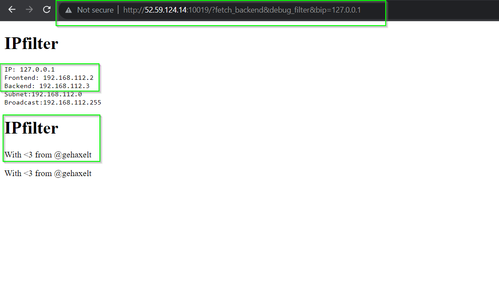

> **Problem Statement:** Let’s ensure that only the frontend can only contact servers from the backend network, except for the one server with all our secret data! Author: @gehaxelt

- Given the website link on the problem page, the website itself does not contain any sort of details. If we look at the page source of the website provided, we can see the comment with **“<! — view source: ?src →”**. Below is the PHP source code provided to us when we go to [**http://52.59.124.14:10019/?src**](http://52.59.124.14:10019/?src=).
- Looking at the code, we find few interesting things:  
	1. There is an IP-filtering function named as “is_bad_ip”, which checks the input against some regex, subnet, and the backend ip.  
	2. There few GET parameters which are: **“fetch_backend”** which will help us get the backend of provided IP, **“bip”** where we need to send the IP for which we need backend data, **“debug_filter”** which specifically shows different IPs.
```php
function is_bad_ip($ip) {  
	if(!preg_match('/^\d{1,3}\.\d{1,3}\.\d{1,3}\.\d{1,3}$/', $ip)) {  
		// IP must be in X.Y.Z.Q format  
		return true;  
	}  
	$frontend = gethostbyname(gethostname());  
	$backend = gethostbyname("ipfilter_backend");  
	$subnet = long2ip(ip2long($frontend) & ip2long("255.255.255.0"));  
	$bcast = long2ip(ip2long($frontend) | ~ip2long("255.255.255.0"));  
  
	if(isset($_GET['debug_filter'])) {  
		echo "<pre>";  
		echo "IP: " . $ip . "<br>";  
		echo "Frontend: " . $frontend . "<br>";  
		echo "Backend: " . $backend . "<br>";  
		echo "Subnet:" . $subnet . "<br>";  
		echo "Broadcast:" . $bcast . "<br>";  
		echo "</pre>";  
	}  
  
	if(inet_pton($ip) < (int) inet_pton($subnet)) {  
		// Do not go below the subnet!  
		return true;  
	}  
	if(! (inet_pton($ip) < inet_pton($bcast))) {  
		// Do not go above the subnet!  
		return true;  
	}  
	if($ip == $backend) {  
		// Do not allow the backend with our secrets ;-)  
		return true;  
	}  
	return false;  
}
```
- Our goal here is to first find the backend IP, and then bypass the IP-filter to get the backend code (where presumably the flag will be).
- As shown in figure 1 below, if we try to all the GET parameters with bip as 127.0.0.1 (meaning get localhost), the URL would look like [http://52.59.124.14:10019/?fetch_backend&debug_filter&bip=127.0.0.1](http://52.59.124.14:10019/?fetch_backend=&debug_filter=&bip=127.0.0.1).



- Here as we can see in Figure 1, we get the backend IP as 192.168.112.3. However if we directly try this IP in the bip field, the script IP-filtering won’t allow us.
- [**https://www.hacksparrow.com/networking/many-faces-of-ip-address.html**](https://www.hacksparrow.com/networking/many-faces-of-ip-address.html) here specifies all the different ways to specify IPs that also works on browsers.
- One of the ways as mentioned in the reference is mixed notation. So, the IP we should try would be “192.168.112.003” where “003” is in octet form, and since PHP won’t evaluate it as octet and directly checks as “192.168.112.003” == “192.168.112.3”, with regex and subnet checks, last backend IP check will be passed, and when the HTTP request is sent, the octet will be evaluated to get proper IP.
- To see in action the URL would look like this: [**http://52.59.124.14:10019/?fetch_backend&debug_filter&bip=192.168.112.003**](http://52.59.124.14:10019/?fetch_backend=&debug_filter=&bip=192.168.112.003), and we see the flag too.

FLAG: _ENO{Another_Fl4G_something_IP_STuff!}_
