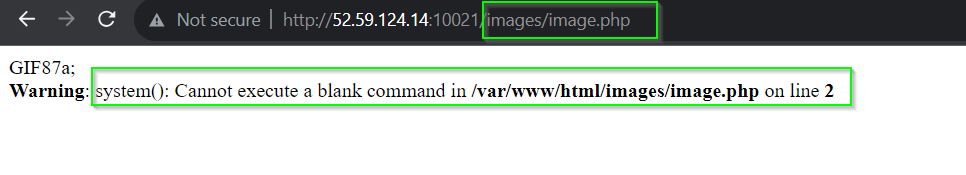

> **Problem Statement:** Who doesn’t love Magical Cars? go checkout this cool website and even upload your fav gif to support it. Author: @moaath

- Looking at the words “Magic” and “Upload GIF”, the first and foremost vulnerability that comes with websites are “Arbitrary File Upload” with magic byte, and null byte file extension manipulation.
- To achieve what we mentioned above, create a new file with contents as shown below, and save it with name “image.php%00.gif”
```php
GIF87a;  
<?php system($_GET["cmd"]); ?>
```
- Here, “GIF87a” will work as Magic bytes or file-type identifier, and it will identify as GIF (**EXTRA:** use `file image.php%00.gif` and you will see file type as GIF).
- **Note** that the filename is “image.php%00.gif” extension. This is because if we used only “.php” or “.gif.php” then the application’s upload filter may complain and won’t allow us to upload file. If we used “.php.gif” then browser would think it as GIF image ignoring the Magic Bytes. So, we need a way where the last extension in name remains “.gif” but the effective extension for browser becomes “.php”. This is where “%00” comes into picture. “%00” is null terminator, which for browsers is string terminator. Thus as far as browser is concerned even though the file name consists “image.php%00.gif”, effectively for browser it is only “image.php”.
- Now if we try to upload, then as shown in the Figure 1 below, we are able to upload the file, and even the file name in the link shows “image.php”.



- Here we also see error for “system()” function because we haven’t passed any command in “cmd” GET parameter yet. In Figure 3 as we can see once we pass valid command let’s say `id` in “cmd” GET parameter, we can execute bash commands now. The term we use for this chain of vulnerabilities is **_Remote Code Execution via Arbitrary File Upload”_**
- Since we can execute any bash commands, looking around is easy, and we will see that in the parent directory of current directory, there is “flag.flag” file (Use command `ls ..` with “cmd” GET parameter). Read it and we get the flag.

FLAG: _ENO{4n_uplo4ded_f1l3_c4n_m4k3_wond3r5}_
